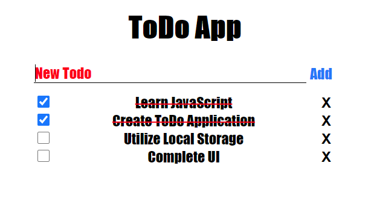

# Futuristic Todo App
A simple and futuristic Todo App written entirely in JavaScript, HTML and CSS

Code Located [Here](https://github.com/hcuellar-coder/TodoApp)
Run Code [Here](https://codepen.io/hcuellar-coder/pen/xxVEZWz)

## Summary
The Todo App, a right of passage as some might say. Clean, Simple, and Futuristic! For this App, I wanted to dive deeper and utilize the local storage to retain the Todo List as well as their completion status. It was definetly a learning experience, and I enjoyed the challenge.

## Author
Heriberto Cuellar – Full Stack Software Developer - [LinkedIn](linkedin.com/in/heriberto-c-5aa11952)